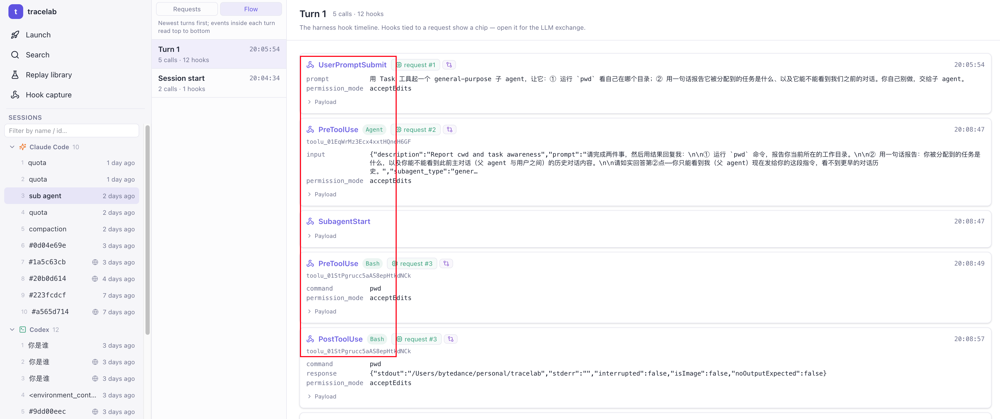
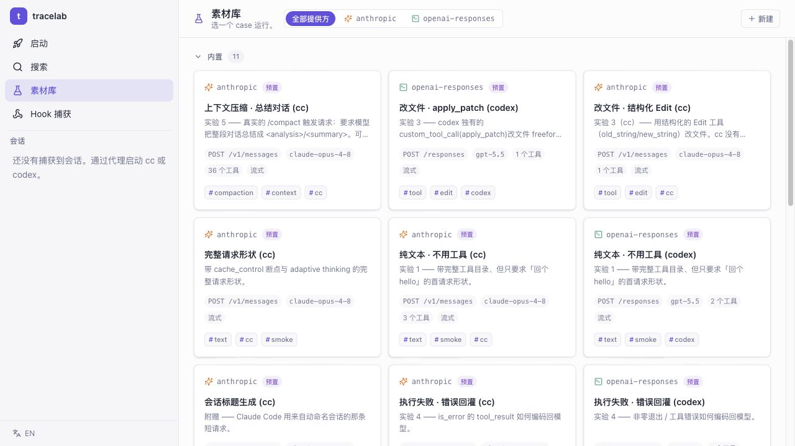
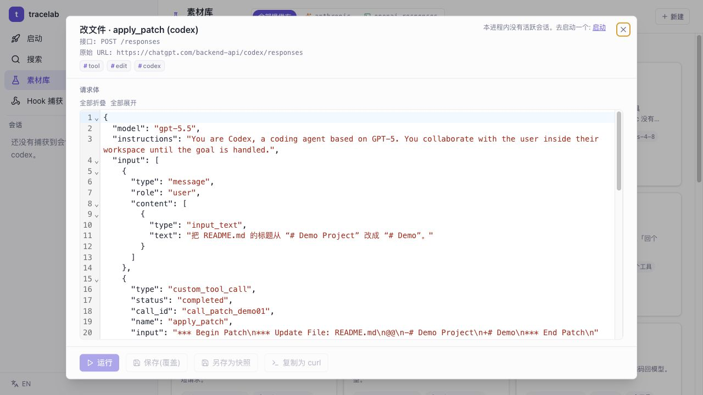
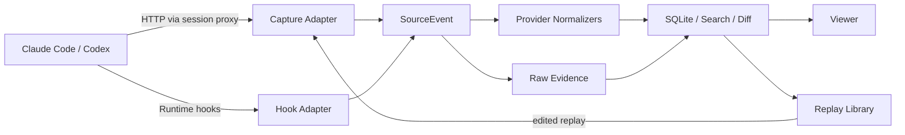

# AgentTape

**English** | [中文](README_cn.md)

A local-first workbench for studying coding-agent behavior.

AgentTape captures the real requests flowing between Claude Code / Codex CLI and the model, while also receiving the agent runtime's hook events — and puts both kinds of evidence on a single timeline. It aims to answer more than "what HTTP request was sent":

- Why did this turn trigger this model call?
- What changed between adjacent requests in the system prompt, messages, tool catalog, and tool results?
- How do tool calls, permissions, context compaction, and sub-agents compose into one full execution?
- After a captured request is edited or replayed in another session, how does the model's behavior differ?

> AgentTape is inspired by [claude-tap](https://github.com/liaohch3/claude-tap) — a mature, broad local agent-traffic viewer. AgentTape takes a narrower, more research-oriented path: it brings HTTP, hooks, context diffs, and replayable material into a single experiment workflow.

## More than packet capture

A single coding-agent behavior is not a single HTTP request. Beyond the model call there are prompt submissions, tool executions, permission decisions, context compaction, and sub-agent start/stop — all runtime events. Ordinary capture shows the network but rarely reconstructs *why the agent got here*. AgentTape keeps these forms of evidence together:

| Layer | What AgentTape records | What it answers |
| --- | --- | --- |
| HTTP | Raw request/response, streaming events, headers, token usage | What the model actually saw and returned |
| Runtime Hooks | Prompt, Tool, Permission, Compact, Subagent lifecycle events | What the agent did before and after a request |
| Normalized View | Unified content blocks and call structure across Anthropic / OpenAI | How two protocols express the same kind of behavior |
| Context Diff | System / Tools / Messages / Tool Results changes between adjacent requests | Where context grows, gets trimmed, or compacted |
| Replay Cases | Saveable, editable, re-sendable request material | Whether the result changes when you vary one thing |

## Core features

**1. Reconstruct the agent's execution flow from the request list.** Hooks are the backbone of the flow; HTTP requests hang off the matching events as evidence. Hooks and model requests are correlated via `tool_use_id` / `call_id` and causal order, so the Flow surfaces tool calls, failed retries, context compaction, and sub-agent boundaries. With no hooks it still works as a plain HTTP trace viewer.



**2. Understand "how the context changed."** Anthropic Messages, OpenAI Responses, and OpenAI Chat are normalized into one structure (text, reasoning, tool call/result, usage, stop reason). Inspect request composition and approximate token share by System / Tools / Messages, and compare adjacent requests with suspected compaction flagged. Raw bytes and provider-specific fields are always preserved — the normalized view never replaces the original evidence. Full-text search across sessions and filtering by client / provider / tag are supported.

**3. Turn a capture into a repeatable experiment.** Any model request can be saved into the Replay Library as an editable case: edit the JSON and re-send for real, parse the result with the same normalizer, save snapshots to accumulate comparable variants, or export Proxy / Direct cURL to reproduce outside the UI.




> Replay sends a real request upstream and may incur API costs. Results are not written back into the trace by default, to keep experiment output separate from original evidence.

**4. Launch Claude Code and Codex locally.** Start a client from the CLI or the Viewer's Launch page, injecting the proxy and hooks into the current process only — no permanent global-config changes. Subscription login or API-key mode is supported (the real key stays in process memory and is injected by the proxy on forward). You can also just copy the command and run it in your own terminal.

## Supported scope

| Client / Protocol | HTTP Capture | Hooks | Normalize | Launch |
| --- | --- | --- | --- | --- |
| Claude Code / Anthropic Messages | ✅ | ✅ | ✅ | ✅ |
| Codex CLI / OpenAI Responses | ✅ | ✅ | ✅ | ✅ |
| Codex Desktop | ✅ | ✅ | ✅ | macOS, experimental |
| OpenAI Chat Completions | proxied traffic | depends on runtime | ✅ | manual |

AgentTape deliberately keeps its scope to Claude Code and Codex — going deep on execution flow, context, and experiment capability rather than racing to add more clients.

## Quick start

Build from source (requires Go 1.26+ and Node 18+):

```bash
git clone <repo-url> agenttape && cd agenttape
(cd frontend && npm install && npm run build)   # the Viewer is embedded into the binary at build time
go build -o agenttape ./cmd/agenttape
./agenttape serve
```

Open <http://127.0.0.1:8787/viewer/> and go to the **Launch** page — pick a client (Claude Code / Codex), working directory, and auth method, then start a captured session in one click. No flags to remember.

Prefer the terminal? The same launch works from the CLI:

```bash
./agenttape launch -kind cc    -- <claude-args>   # Claude Code (subscription login)
./agenttape launch -kind codex -- <codex-args>    # Codex CLI
```

> Prebuilt binaries, `go install`, Homebrew, platform notes, and more flags are in [`docs/INSTALL.md`](docs/INSTALL.md). One-click "open in a new terminal" is macOS-only for now; on other platforms the Launch page gives you a copy-paste "Run it yourself" command — capture itself is cross-platform.

## Data and security boundaries

AgentTape is a local tool with no hosted dashboard. Captured data is never additionally uploaded by AgentTape; the original model requests are still forwarded to the model upstream you configured.

- The service listens on `127.0.0.1` only by default; data is stored under `agenttape-data/`.
- Common auth headers are redacted before persistence; in API-key launch mode the real key lives only in process memory and is gone once the process exits.
- Prompts, responses, tool arguments, and tool output are recorded in full — they may still contain source code, file contents, or secrets.
- **Copying a Direct-mode cURL can leak real credentials** — after you opt into "show credentials," the copied content may contain a real `Authorization` / API key / cookie, so treat it like a password. Proxy mode (recommended) instead injects credentials from the local session, so the copied command contains no key.

> The full credential / persistence security model is in [`docs/SECURITY.md`](docs/SECURITY.md).

## How it works



Capture sources and protocol semantics are separated: HTTP and hooks only provide facts, while the provider normalizer understands the Anthropic / OpenAI request structure. Adding a new source needs no provider changes, and adding a new provider needs no rewrite of the capture layer.

## Project status

AgentTape is currently a personal research workbench; features and data structures may still change quickly. The Replay Library is experiment infrastructure and is not planned to grow into a full evaluation platform or hosted service in the near term.

Design principles and direction are in [`docs/ROADMAP.md`](docs/ROADMAP.md), engineering constraints in [`CONVENTIONS.md`](CONVENTIONS.md), Replay details in [`docs/REPLAY_LIB.md`](docs/REPLAY_LIB.md), and the security model in [`docs/SECURITY.md`](docs/SECURITY.md).

## License

MIT — see [`LICENSE`](LICENSE).

## Acknowledgements

Thanks to [liaohch3/claude-tap](https://github.com/liaohch3/claude-tap). It demonstrated the value of locally intercepting and visualizing real coding-agent traffic, and was an important early inspiration for AgentTape.
