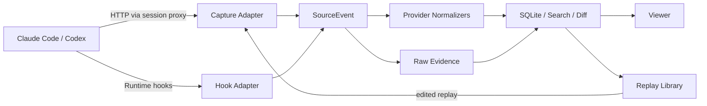

# TraceLab

本地优先的 Coding Agent 行为研究工作台。

> 当前已覆盖捕获、归一化、SQLite 持久化、React Viewer、Flow / Context Diff、
> Replay Library 与本地启动。实现状态与剩余验证见 [`WORKLOG.md`](WORKLOG.md)。

TraceLab 捕获 Claude Code、Codex CLI 与模型之间的真实请求，同时接收 Agent Runtime 的 Hook 事件。它不只回答“发了什么 HTTP 请求”，还试图回答：

- 这一轮为什么触发了这次模型调用？
- System Prompt、消息、工具目录和工具结果在相邻请求间发生了什么变化？
- 工具调用、权限、上下文压缩和子 Agent 如何组成一次完整执行？
- 同一条请求经过编辑或换一个会话重放后，模型行为有什么不同？

> TraceLab 受到 [claude-tap](https://github.com/liaohch3/claude-tap) 的启发。claude-tap 是成熟、覆盖面广的本地 Agent 流量查看器；TraceLab 选择一条更窄、更偏研究的路线：把 HTTP、Hooks、上下文差异和可重放素材放进同一个实验工作流。

## 它不只是抓包

Coding Agent 的一次行为并不等于一次 HTTP 请求。模型调用之外，还有 Prompt 提交、工具执行、权限决策、上下文压缩、子 Agent 启停等 Runtime 事件。普通 HTTP 抓包能看到网络，但很难还原“Agent 为什么走到这里”。

TraceLab 把两类证据合在一起：

| 观察层 | TraceLab 记录什么 | 用来回答什么问题 |
| --- | --- | --- |
| HTTP | 原始请求/响应、流式事件、Headers、Token Usage | 模型真正看到了什么、返回了什么 |
| Runtime Hooks | Prompt、Tool、Permission、Compact、Subagent 等生命周期事件 | Agent 在请求前后做了什么 |
| Normalized View | 跨 Anthropic / OpenAI 的统一内容块与调用结构 | 两种协议如何表达同一类行为 |
| Context Diff | 相邻请求的 System、Tools、Messages、Tool Results 变化 | 上下文在哪里增长、裁剪或压缩 |
| Replay Cases | 可保存、编辑、重发的请求素材 | 改一个变量后结果是否变化 |

TraceLab 的目标不是成为一个覆盖所有客户端的通用代理，而是成为一个能反复拆解 Claude Code / Codex 行为的本地实验台。

## 核心功能

### 1. 从请求列表还原 Agent 执行流

TraceLab 同时接收反向代理流量和 Harness Hooks，并把它们合并到同一条时间线。Hook 是执行流的主干，HTTP 请求作为证据挂在对应事件上。

- 查看 `UserPromptSubmit`、`PreToolUse`、`PostToolUse`、`PermissionRequest` 等事件。
- 通过 `tool_use_id` / `call_id` 和因果顺序关联 Hook 与模型请求。
- 在 Flow 中识别工具调用、失败重试、上下文压缩和子 Agent 边界。
- 没有 Hooks 时仍可作为纯 HTTP Trace Viewer 使用。

### 2. 看懂“上下文是怎么变的”

除了原始 JSON，TraceLab 会把 Anthropic Messages、OpenAI Responses 和 OpenAI Chat 归一化成统一结构：文本、Reasoning、Tool Call、Tool Result、Usage、Stop Reason 等。

- 按 System / Tools / Messages 查看请求构成及近似 Token 占比。
- 比较相邻请求，标记新增 Tool Result、System 变化和疑似 Compaction。
- 同时保留原始字节与 Provider-specific 字段，不用归一化结果替代原始证据。
- 支持跨会话全文搜索，以及按 Client、Provider、Tag 过滤。

### 3. 把一次捕获变成可重复实验

任何模型请求都可以保存进 Replay Library，成为一个可编辑的 Case。Case 保存请求体和路由信息，运行时由当前 Live Session 提供上游和凭证。


- 编辑 JSON 后真实重发，并用与抓包相同的 Normalizer 解析结果。
- 另存 Snapshot，保留原始 Case，积累一组可比较的请求变体。
- 内置 Claude Code / Codex 请求样例，覆盖纯文本、工具回灌、改文件、执行失败和上下文压缩。
- 以 Proxy 或 Direct 两种方式生成 cURL，便于离开 UI 复现实验。


> Replay 会向真实上游发起请求，可能产生 API 费用。结果默认不写回 Trace，避免把实验输出和原始证据混在一起。

### 4. 本地启动 Claude Code 与 Codex

TraceLab 可以从 CLI 或 Viewer 的 Launch 页启动客户端，把代理和 Hooks 只注入当前进程，不要求永久修改全局配置。

- Claude Code 与 Codex CLI：支持订阅登录或 API Key 模式。
- API Key 模式：真实 Key 保留在 TraceLab 进程内存中，由代理转发时注入。
- Codex Desktop：提供配置备份、临时注入与逐字节恢复流程。
- 也可以只复制命令，在自己的终端里手动运行。

Web 端一键打开终端目前面向 macOS；CLI 捕获与 Viewer 本身不依赖这项能力。

## 支持范围

| Client / Protocol | HTTP Capture | Hooks | Normalize | Launch |
| --- | --- | --- | --- | --- |
| Claude Code / Anthropic Messages | ✅ | ✅ | ✅ | ✅ |
| Codex CLI / OpenAI Responses | ✅ | ✅ | ✅ | ✅ |
| Codex Desktop | ✅ | ✅ | ✅ | macOS 实验性支持 |
| OpenAI Chat Completions | 兼容代理流量 | 取决于 Runtime | ✅ | 手动接入 |

TraceLab 当前刻意把范围控制在 Claude Code 与 Codex。优先级是把执行流、上下文和实验能力做深，而不是快速增加客户端数量。

## 快速开始

### 依赖

- Go 1.26.2+
- Node.js 与 npm（用于构建 Viewer）
- 已安装并完成登录的 `claude` 或 `codex`

### 构建

```bash
go build -o ./tracelab ./cmd/tracelab

cd frontend
npm ci
npm run build
cd ..
```

### 启动 TraceLab

```bash
./tracelab serve \
  -listen 127.0.0.1:8787 \
  -data ./tracelab-data \
  -viewer ./frontend/dist
```

打开 <http://127.0.0.1:8787/viewer/>。

### 启动一个捕获会话

```bash
# Claude Code
./tracelab launch -kind cc -server http://127.0.0.1:8787 -- <claude-args>

# Codex CLI（默认使用已有的 ChatGPT subscription 登录）
./tracelab launch -kind codex -server http://127.0.0.1:8787 -- <codex-args>

# Codex CLI + OpenAI Platform API Key
OPENAI_API_KEY=<YOUR_KEY> ./tracelab launch \
  -kind codex \
  -server http://127.0.0.1:8787 \
  -upstream https://api.openai.com/v1
```

也可以在 Viewer 的“启动”页选择工作目录、客户端和认证方式。

## 数据与安全边界

TraceLab 是本地工具，不需要托管 Dashboard。采集数据不会被 TraceLab 额外上传；原始模型请求仍会照常转发到你配置的模型上游。

- 服务默认只监听 `127.0.0.1`。
- 数据保存在 `tracelab-data/tracelab.db` 与 `tracelab-data/raw/`。
- 常见认证 Headers 会在持久化前脱敏。
- API Key Launch 模式中的真实 Key 只保存在当前进程内存，进程退出后失效。
- Prompt、响应、工具参数和工具输出会被完整记录，它们本身仍可能包含源码、文件内容、个人信息或应用层秘密。

### 特别注意：复制 cURL 可能复制出真实凭证

Replay Library 的“复制为 cURL”提供两种模式：

- **Proxy 模式（推荐）**：请求发给本机 TraceLab，由 Live Session 注入凭证；复制出的命令不包含真实 API Key。
- **Direct 模式**：请求直接发给模型上游。认证信息默认打码，但在用户主动选择显示后，复制内容可能包含真实 `Authorization`、API Key、Cookie 或其他认证 Header。

请把显示后的 Direct cURL 当作密码处理：

- 不要粘贴到 Issue、聊天、文档、CI 日志或屏幕录制中。
- 注意剪贴板管理器和 Shell History 可能长期保留命令。
- 在共享电脑或直播/录屏时不要启用“显示凭证”。
- 如果误发，立即撤销或轮换对应凭证。

导出的 Raw Trace 也应视为敏感数据。即使 Header 已脱敏，Prompt 或 Tool Result 中仍可能出现用户主动放入正文的 Token、`.env` 内容或其他秘密。

## 工作原理



采集来源与协议语义是分离的：HTTP 和 Hooks 只负责提供事实，Provider Normalizer 负责理解 Anthropic / OpenAI 的请求结构。增加新的来源不需要修改 Provider，增加新的 Provider 也不需要重写采集层。

## 适合用来研究什么

- Claude Code 与 Codex 的 System Prompt、工具目录和协议差异。
- Tool Call / Tool Result 如何回灌到下一次请求。
- Agent 为什么重试，以及错误信息如何影响后续决策。
- Context Compaction 前后保留了什么、丢失了什么。
- 子 Agent 得到了哪些 System、Tools、History 与工作目录。
- 同一请求修改模型、参数、Prompt 或工具结果后的行为变化。

## 项目状态

TraceLab 目前是一个个人研究工作台，功能与数据结构仍可能快速变化。Replay Library 是实验基础设施，不计划在短期内扩张成完整的评测平台、批量 Benchmark 或托管服务。

详细设计与约束见 [`CONVENTIONS.md`](CONVENTIONS.md)、[`REPLAY_LIB.md`](REPLAY_LIB.md)
和 [`docs/SECURITY.md`](docs/SECURITY.md)。开源发布门槛与历史扫描记录见
[`security-audit/`](security-audit/)。

## 致谢

感谢 [liaohch3/claude-tap](https://github.com/liaohch3/claude-tap)。它展示了本地拦截与可视化真实 Coding Agent 流量的价值，也是 TraceLab 最初的重要灵感来源。
