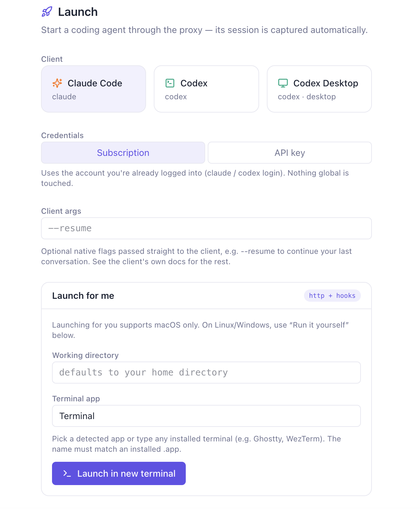
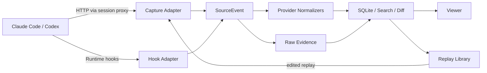

# AgentTape

[English](README.md) | **中文**

本地优先的 Coding Agent 行为研究工作台。

AgentTape 捕获 Claude Code、Codex CLI 与模型之间的真实请求，同时接收 Agent Runtime 的 Hook 事件，把两类证据合到同一条时间线上。它想回答的不只是"发了什么 HTTP 请求"，而是：

- 这一轮为什么触发了这次模型调用？
- System Prompt、消息、工具目录和工具结果在相邻请求间发生了什么变化？
- 工具调用、权限、上下文压缩和子 Agent 如何组成一次完整执行？
- 同一条请求经过编辑或换一个会话重放后，模型行为有什么不同？

> AgentTape 受 [claude-tap](https://github.com/liaohch3/claude-tap) 启发——一个成熟、覆盖面广的本地 Agent 流量查看器。AgentTape 选了一条更窄、更偏研究的路线：把 HTTP、Hooks、上下文差异和可重放素材放进同一个实验工作流。

## 它不只是抓包

Coding Agent 的一次行为并不等于一次 HTTP 请求。模型调用之外，还有 Prompt 提交、工具执行、权限决策、上下文压缩、子 Agent 启停等 Runtime 事件。普通抓包能看到网络，却很难还原"Agent 为什么走到这里"。AgentTape 把这些证据放在一起看：

| 观察层 | AgentTape 记录什么 | 用来回答什么 |
| --- | --- | --- |
| HTTP | 原始请求/响应、流式事件、Headers、Token Usage | 模型真正看到了什么、返回了什么 |
| Runtime Hooks | Prompt、Tool、Permission、Compact、Subagent 等生命周期事件 | Agent 在请求前后做了什么 |
| Normalized View | 跨 Anthropic / OpenAI 的统一内容块与调用结构 | 两种协议如何表达同一类行为 |
| Context Diff | 相邻请求的 System、Tools、Messages、Tool Results 变化 | 上下文在哪里增长、裁剪或压缩 |
| Replay Cases | 可保存、编辑、重发的请求素材 | 改一个变量后结果是否变化 |

## 核心功能

**1. 从请求列表还原 Agent 执行流。** Hook 是执行流的主干，HTTP 请求作为证据挂在对应事件上。通过 `tool_use_id` / `call_id` 和因果顺序关联 Hook 与模型请求，在 Flow 中识别工具调用、失败重试、上下文压缩和子 Agent 边界。没有 Hooks 时仍可作为纯 HTTP Trace Viewer 使用。


**2. 看懂"上下文是怎么变的"。** 把 Anthropic Messages、OpenAI Responses 和 OpenAI Chat 归一化成统一结构（文本、Reasoning、Tool Call/Result、Usage、Stop Reason），按 System / Tools / Messages 查看请求构成与近似 Token 占比，比较相邻请求并标记疑似 Compaction。原始字节与 Provider-specific 字段始终保留，不用归一化替代原始证据。支持跨会话全文搜索与按 Client / Provider / Tag 过滤。

**3. 把一次捕获变成可重复实验。** 任何模型请求都能保存进 Replay Library 成为可编辑的 Case：改 JSON 后真实重发、用同一套 Normalizer 解析结果、另存 Snapshot 积累可比较的请求变体，或导出 Proxy / Direct 两种 cURL 离开 UI 复现。


> Replay 会向真实上游发起请求，可能产生 API 费用。结果默认不写回 Trace，避免实验输出和原始证据混在一起。

**4. 本地启动 Claude Code 与 Codex。** 从 CLI 或 Viewer 的 Launch 页启动客户端，把代理和 Hooks 只注入当前进程，不永久修改全局配置。支持订阅登录或 API Key 模式（真实 Key 只留在进程内存，由代理转发时注入）。也可以只复制命令在自己终端里手动运行。

## 支持范围

| Client / Protocol | HTTP Capture | Hooks | Normalize | Launch |
| --- | --- | --- | --- | --- |
| Claude Code / Anthropic Messages | ✅ | ✅ | ✅ | ✅ |
| Codex CLI / OpenAI Responses | ✅ | ✅ | ✅ | ✅ |
| Codex Desktop | ✅ | ✅ | ✅ | macOS 实验性支持 |
| OpenAI Chat Completions | 兼容代理流量 | 取决于 Runtime | ✅ | 手动接入 |

AgentTape 刻意把范围控制在 Claude Code 与 Codex——优先把执行流、上下文和实验能力做深，而不是快速增加客户端数量。

## 快速开始

源码编译（需要 Go 1.26+、Node 18+）：

```bash
git clone <repo-url> agenttape && cd agenttape
(cd frontend && npm install && npm run build)   # Viewer 编译期内嵌进二进制
go build -o agenttape ./cmd/agenttape
./agenttape serve
```

打开 <http://127.0.0.1:8787/viewer/>，进入 **「启动」页** —— 选客户端（Claude Code / Codex）、工作目录和认证方式，一键起一个被捕获的会话，不用记任何 flag。



更喜欢终端？同样的启动也能用 CLI：

```bash
./agenttape launch -kind cc    -- <claude-args>   # Claude Code（订阅登录）
./agenttape launch -kind codex -- <codex-args>    # Codex CLI
```

> 预编译二进制、`go install`、Homebrew、平台说明与更多参数见 [`docs/INSTALL.md`](docs/INSTALL.md)。Web 端一键开新终端目前仅 macOS；其它平台用「启动」页的「自己运行」复制命令，捕获本身跨平台。

## 数据与安全边界

AgentTape 是本地工具，不需要托管 Dashboard。采集数据不会被 AgentTape 额外上传；原始模型请求仍照常转发到你配置的模型上游。

- 服务默认只监听 `127.0.0.1`，数据保存在 `agenttape-data/`。
- 常见认证 Headers 会在持久化前脱敏；API Key Launch 模式的真实 Key 只在进程内存，退出即失效。
- Prompt、响应、工具参数和工具输出会被完整记录，它们本身仍可能包含源码、文件内容或秘密。
- **复制 Direct 模式 cURL 可能带出真实凭证**——主动选择"显示凭证"后，复制内容可能包含真实 `Authorization` / API Key / Cookie，请当作密码处理。Proxy 模式（推荐）则由本机 Session 注入凭证，复制命令不含 Key。

> 完整的凭证 / 持久化安全模型见 [`docs/SECURITY.md`](docs/SECURITY.md)。

## 工作原理



采集来源与协议语义是分离的：HTTP 和 Hooks 只提供事实，Provider Normalizer 负责理解 Anthropic / OpenAI 的请求结构。增加新来源不必改 Provider，增加新 Provider 也不必重写采集层。

## 项目状态

AgentTape 目前是个人研究工作台，功能与数据结构仍可能快速变化。Replay Library 是实验基础设施，不计划短期内扩张成完整评测平台或托管服务。

设计原则与方向见 [`docs/ROADMAP.md`](docs/ROADMAP.md)，工程约束见 [`CONVENTIONS.md`](CONVENTIONS.md)，Replay 细节见 [`docs/REPLAY_LIB.md`](docs/REPLAY_LIB.md)，安全模型见 [`docs/SECURITY.md`](docs/SECURITY.md)。

## License

MIT —— 见 [`LICENSE`](LICENSE)。

## 致谢

感谢 [liaohch3/claude-tap](https://github.com/liaohch3/claude-tap)。它展示了本地拦截与可视化真实 Coding Agent 流量的价值，也是 AgentTape 最初的重要灵感来源。
